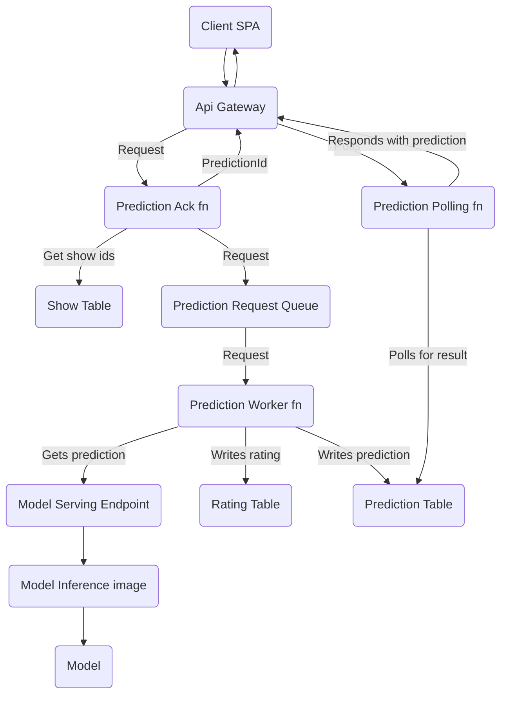
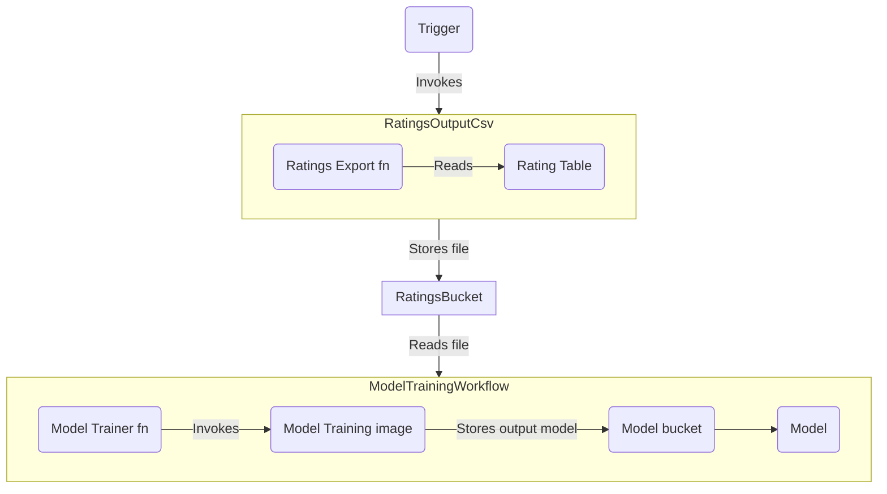

# canihasashowplz

The application and model-training code to create `canihasashowplz`.
This a television show recommendation system leveraging machine learning to provide users with recommendations based on their input show preferences.
I developed it as a learning exercise to explore mlops, data science, and to solve the recurring dilemma whenever my spouse and I finish whatever we're watching together.
Previous Jupyter notebook exploration and web scraping code can be found in [this repo](https://github.com/laaksomavrick/tv-show-recommender-exploration).

## Project architecture

### Model serving and service-APIs

Clients make a request, are given a prediction id in response, and then the front end polls until the prediction is processed.
Since predictions can take >30 seconds, we need to process the request in the background and respond when we have the information from the model.

### Model training

A trigger (currently manually, but eventually a recurring job or some threshold of new ratings being reached) kicks off a data export which is then consumed by our model trainer and outputs a new model using the updated data.

## Deployment concerns

A single `template.yaml` contains all the Cloudformation definitions for service and its dependencies. However, at the moment, deployment is a two-step process (which I will eventually solve with a custom resource or similar).

First, you must deploy the model training architecture, invoke the ratings export function, and then invoke the model training function.
These are orchestrated as a set of step functions.
Once the job is complete, then you can deploy the model serving architecture.
This is due to the `SageMaker::Model` having a dependency on an artifact in an `S3` bucket (i.e., the model output).
Further, I have my own data set scraped from the internet which populates the DynamoDB tables for shows and ratings. A blank slate of data won't be especially fun for recommendations.

This is only a concern for the first-time setup of this project. Once that is complete, further changes can be made through `make build-staging` and `make deploy-staging` or via CI/CD and pull requests.