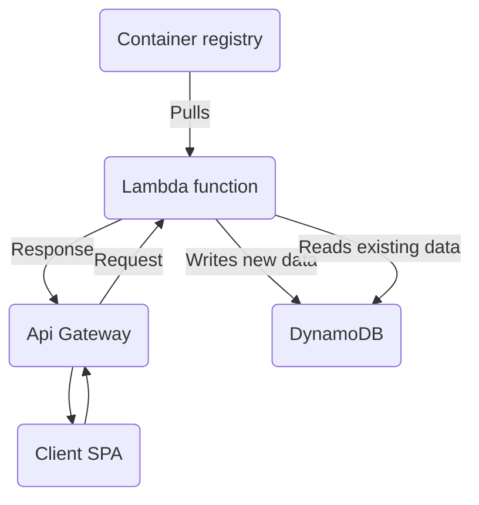
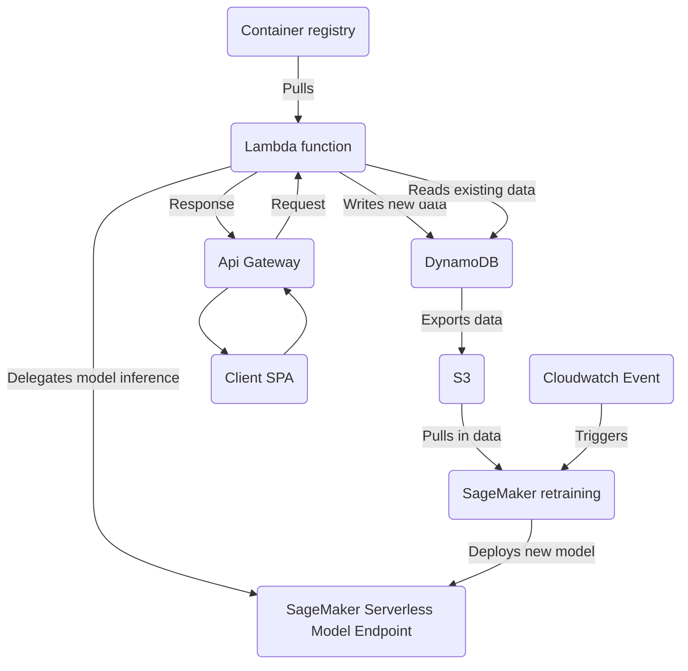

# canihaveashowplz

Application and model-training code to create `canihaveashowplz`.

Notebook exploration and web scraping code can be found in [this repo](https://github.com/laaksomavrick/tv-show-recommender-exploration).

## Architecture

Stage 1:

Stage 2:

